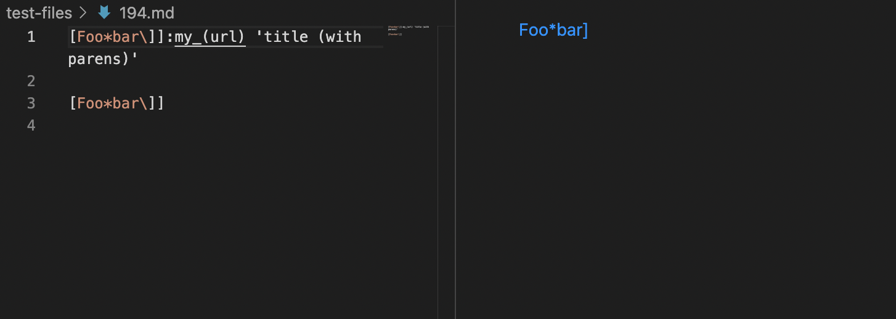

# Lap Report Week 10
## How to find difference
- Using vimdiff on the results of running a bash for loop.
## Test files with different results
- [markdown-parser/test-files/194.md](https://github.com/nidhidhamnani/markdown-parser/blob/main/test-files/194.md)
- [markdown-parser/test-files/201.md](https://github.com/nidhidhamnani/markdown-parser/blob/main/test-files/201.md)

## Test file 194

* This screenshot represents the difference between the two results.txt. The file at the left hand side is my file, and the file at the right hand side is instructor's file.

    
    * based on the VSCode the expected output should be [], so none of the output is right.

- **My result**

