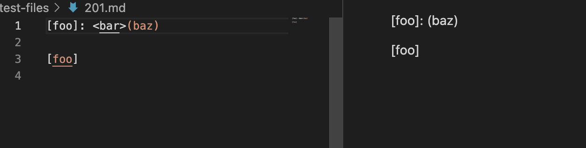

# Lap Report Week 10
## How to find difference
- Using vimdiff on the results of running a bash for loop.
## Test files with different results
- [markdown-parser/test-files/194.md](https://github.com/nidhidhamnani/markdown-parser/blob/main/test-files/194.md)
- [markdown-parser/test-files/201.md](https://github.com/nidhidhamnani/markdown-parser/blob/main/test-files/201.md)

## Test file 194

* This screenshot represents the difference between the two results.txt. The file at the left hand side is my file, and the file at the right hand side is instructor's file.

    
    * based on the VSCode the expected output should be [], so none of the output is right.

## Test file 201

* This screenshot represents the difference between the two results.txt. The file at the left hand side is my file, and the file at the right hand side is instructor's file.

    
    * based on the VSCode the expected output should be [], so none of the output is right.

- **My result**
    * I found that both false outputs are caused by similar problems, so I will explain them together.

    * I should add code that can make sure the closeBracket are next to the oenParen.
    * Also I didn't deal with the matched/unmatched brackets/parentheses problems. It will be better for me to add a similar findCloseParen method and findClseBrackets as this.
     

- **The other result**
    * I found that both false outputs are caused by similar problems, so I will explain them together.

    * It should add code that can make sure the closeBracket are next to the oenParen.
     
    * The code has deal with the matched/unmatched brackets/parentheses problems, but I think it is still not enough. Other functions like findClseBrackets and findClseParentheses should be added to optimize the profermance.

