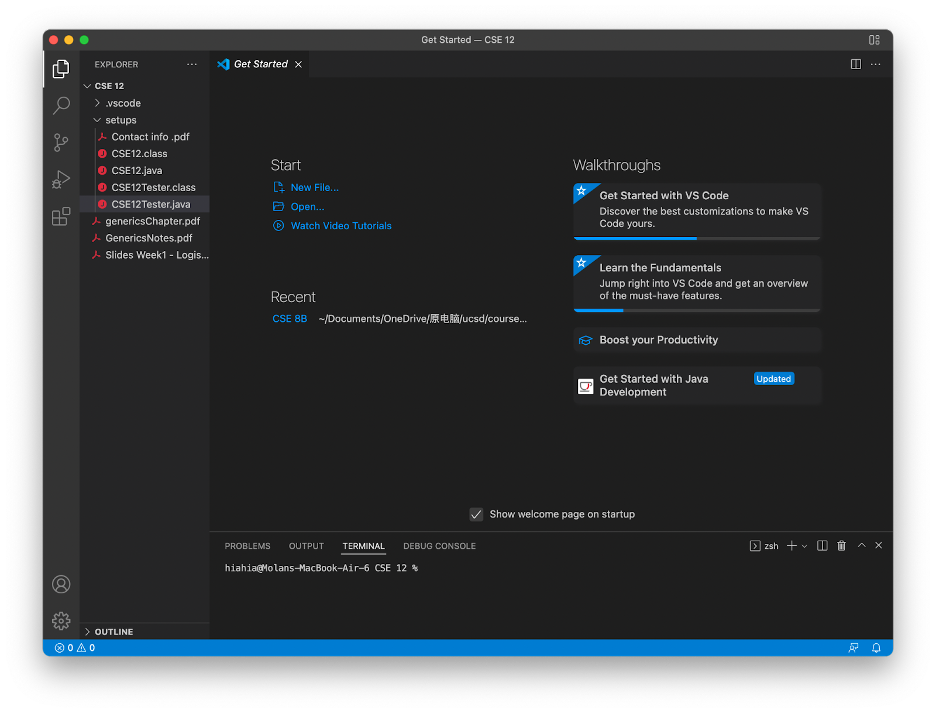
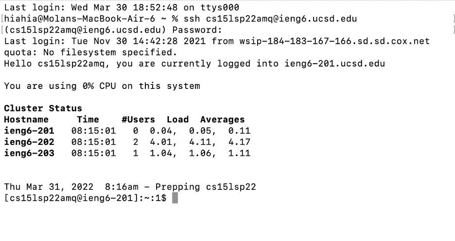
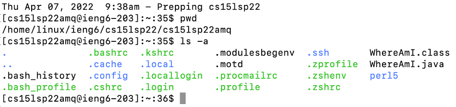
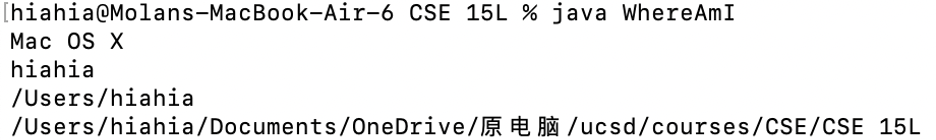
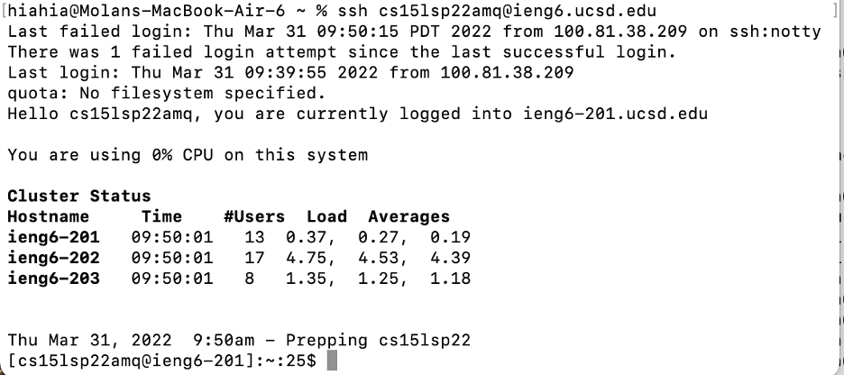

# lab-report-1-week-2

Tutor about how to log into a course-specific account on ieng6.

First, you need to install Visual Studio Code (or use a terminal on your computer, they are basically the same).

Second, look up your course-specific account for CSE15L in [UCSD_Website](https://sdacs.ucsd.edu/~icc/index.php)

Third, open a terminal and type in ssh cs15lsp22zz@ieng6.ucsd.edu. (replace zz with the letters in your course-specific account.)

If you see something like the picture above, congratulations, you are login in successfully!

You can try some command.

