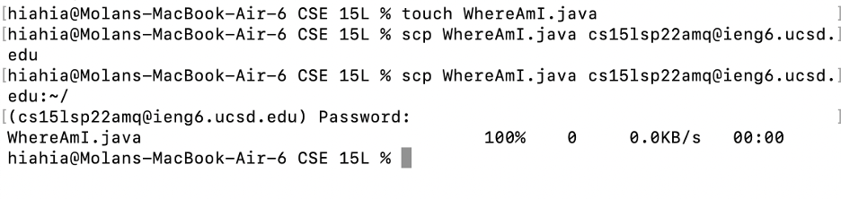

# lab-report-1-week-2

Tutor about how to log into a course-specific account on ieng6.

1. you need to install Visual Studio Code (or use a terminal on your computer, they are basically the same).

2. look up your course-specific account for CSE15L in [UCSD_Website](https://sdacs.ucsd.edu/~icc/index.php)

3. open a terminal and type in ssh cs15lsp22zz@ieng6.ucsd.edu. (replace zz with the letters in your course-specific account.)

    If you see something like the picture above, congratulations, you are login in successfully!

You can try some command.
* cd ~
* cd
* ls -lat
* ls -a

Using _command scp_ to copy a file from my computer to a remote computer.

* Compile and run the java file from _the server_.

* Compile and run the java file from _the client_.

We can establish a ssh key to avoid typing (or copy-paste) our password while connecting to the server.

1. Using ssh-keygen to generate _public and private key_.
2. Enter the file in which to save the key.
3. Go to the server, and copy the _public key_ to the .ssh folder.

After using the public and private keys, I can log in/scp files easier without using a password!

