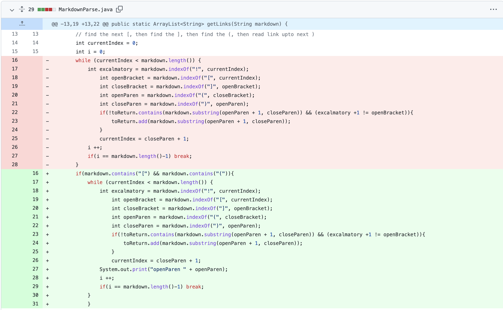
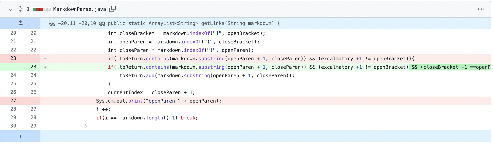

# lab-report-1-week-4
## Change 1

## Change 2
* Screenshot of changing code

* the link to a test file [hidden-test2](https://github.com/molan0426/markdown-parser/blob/main/hidden-test2.md)
* symptom of that failure-inducing input: 
    
    Exception in thread "main" java.lang.StringIndexOutOfBoundsException: begin 0, end -1, length 18
        at java.base/java.lang.String.checkBoundsBeginEnd(String.java:4601)
        at java.base/java.lang.String.substring(String.java:2704)
        at MarkdownParse.getLinks(MarkdownParse.java:18)
        at MarkdownParse.main(MarkdownParse.java:38)

* The bug in the original program is that I fail to consider the case in which the file only contains "[]" . In the failure-inducing input (hidden-test2.md), there are two "[]" but no "()". Since the indexOf method return -1 when it can't find "(", this return (-1) will cause index out of bound exception.

## Change 3
* Screenshot of changing code

* the link to a test file [hidden-test4](https://github.com/molan0426/markdown-parser/blob/main/hidden-test4.md)
* symptom of that failure-inducing input: [, I know you want to deceive me! I won't let you success! ]
* The bug in the original program is that I fail to consider the case in which "[]" and "()" are far apart. In the failure-inducing input (hidden-test4.md), there are two groups of separated "[]" and "()"-- one appears in the header of the file, and another one appears in the text.