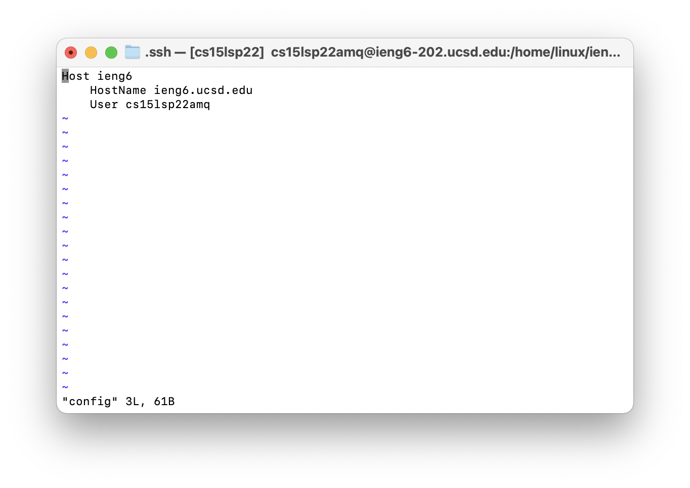
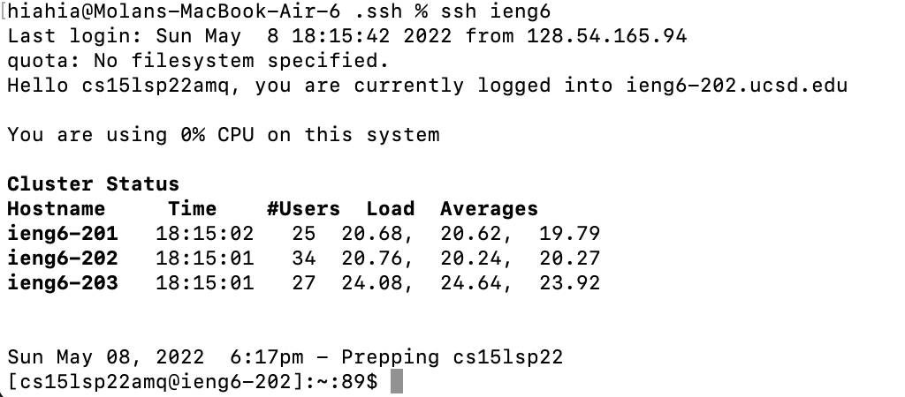
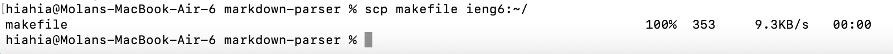

# lab-report-week-6
## Streamlining ssh Configuration
* .ssh/config file

    How to edit the file: First, change directory to .ssh folder. Second, type "vim config". Third, press "i" to insert content, and press "esc" (keyboard) and ":wq" to quit editing. 
* Log into my account

    With the config file, I can enter my account on ieng6 with less typing.
* scp a file

