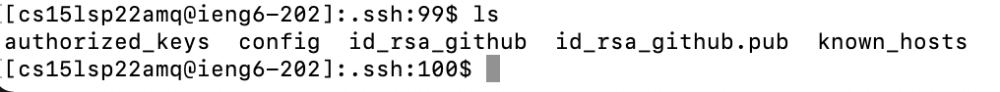
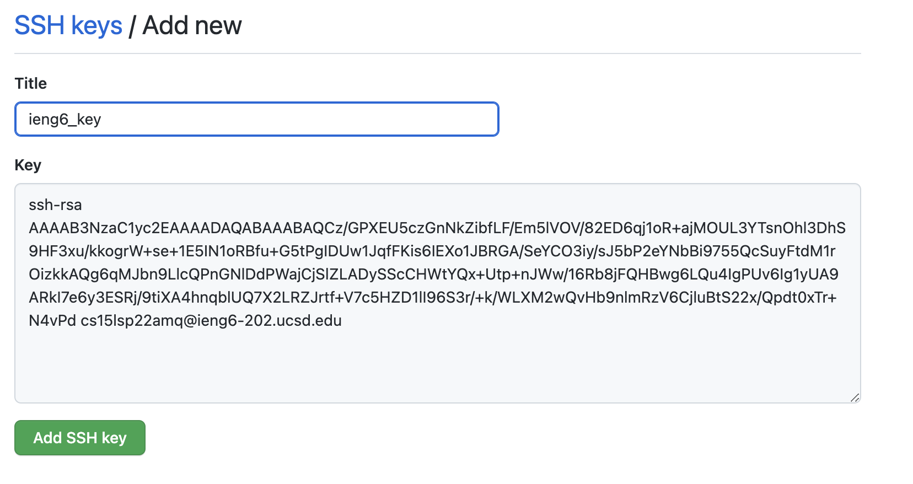
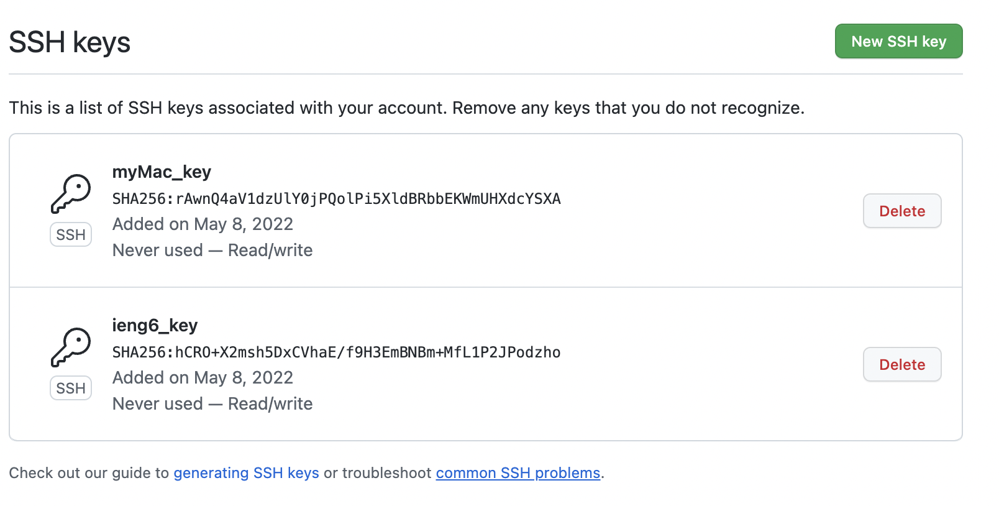
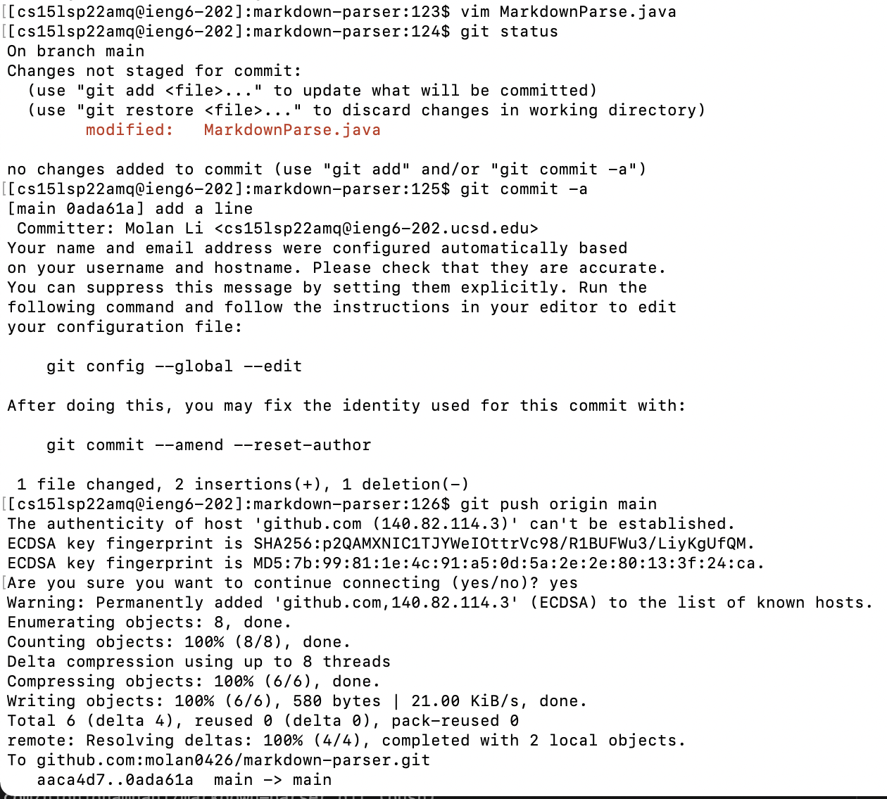
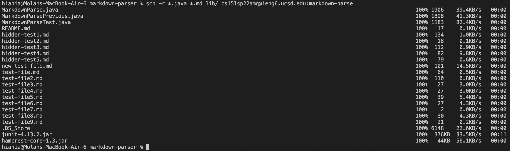
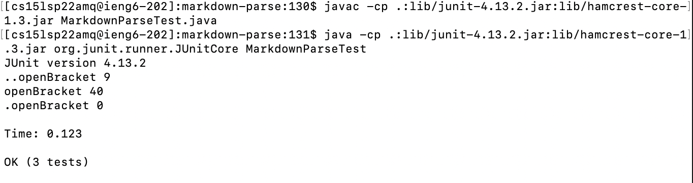
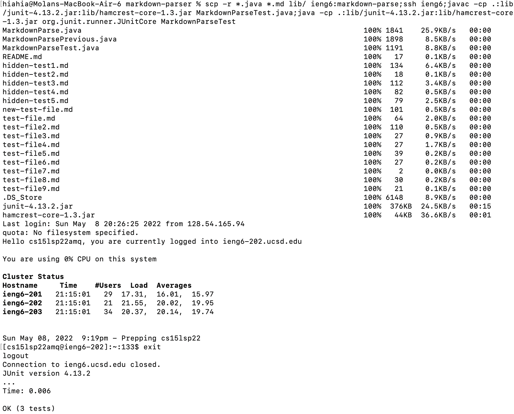

# lab-report-week-6
## Streamlining ssh Configuration
* .ssh/config file

    How to edit the file: First, change directory to .ssh folder. Second, type "vim config". Third, press "i" to insert content, and press "esc" (keyboard) and ":wq" to quit editing. 
* Log into my account

    With the config file, I can enter my account on ieng6 with less typing.
* scp a file

    I can write "scp makefile ieng6:~/" instead of "scp makefile cs15lsp22amq@ieng6.ucsd.edu:~/"

## Setup Github Access from ieng6
* Public & Private key stored on my user account (ieng6)

    Public and private keys are in .ssh folder. "id_rsa_github_pub" is the public key, and "id_rsa_github" is the private key.
* Public key stored on the Github.

add a new ssh key on Github

The myMac_key is the ssh key of my computer, and the ieng6_key is the ssh key of my user account on ieng6.
* commit and push a change.

With ssh key, I don't need to type in username and password when we commit and push files.

## Copy whole directories with scp -r
* copy markdown-parse directory to ieng6 account.

    Copy all files with .md extension and files in the lib folder.
* Compile and run the test on ieng6 account

* Copy and Run the test file in one line.

Combine scp, ;, and ssh to copy the whole directory and run the tests in one line.