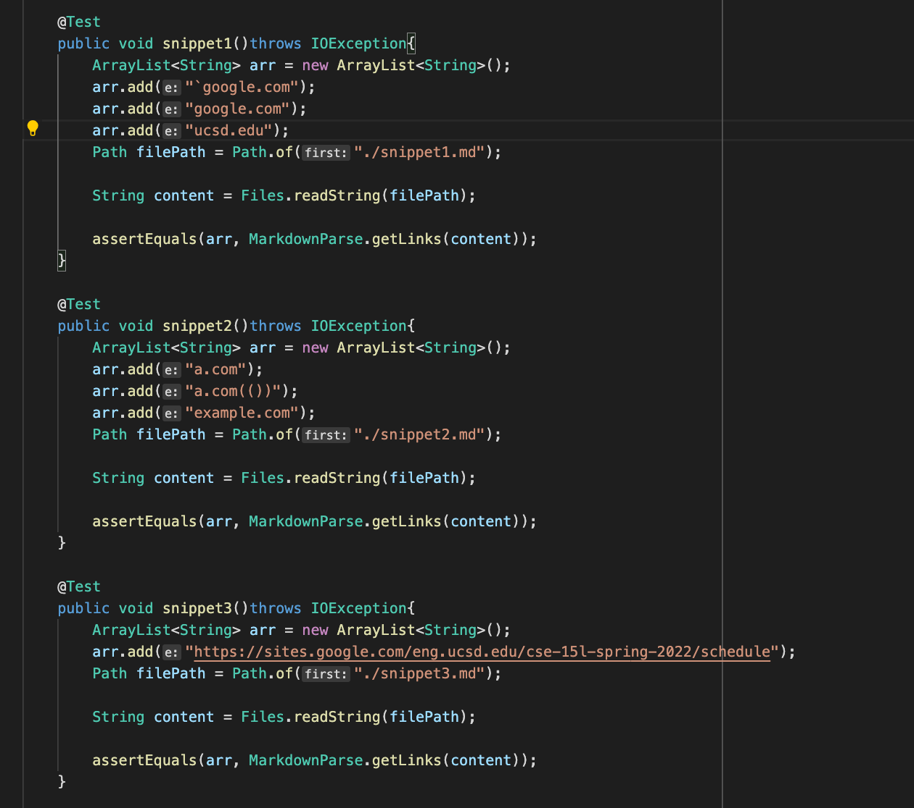
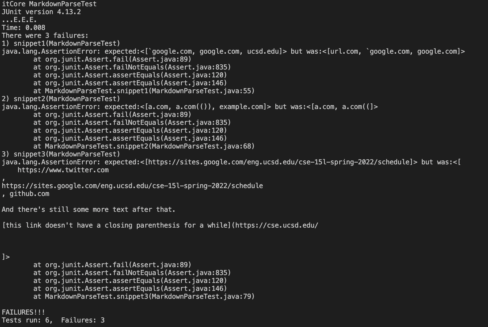
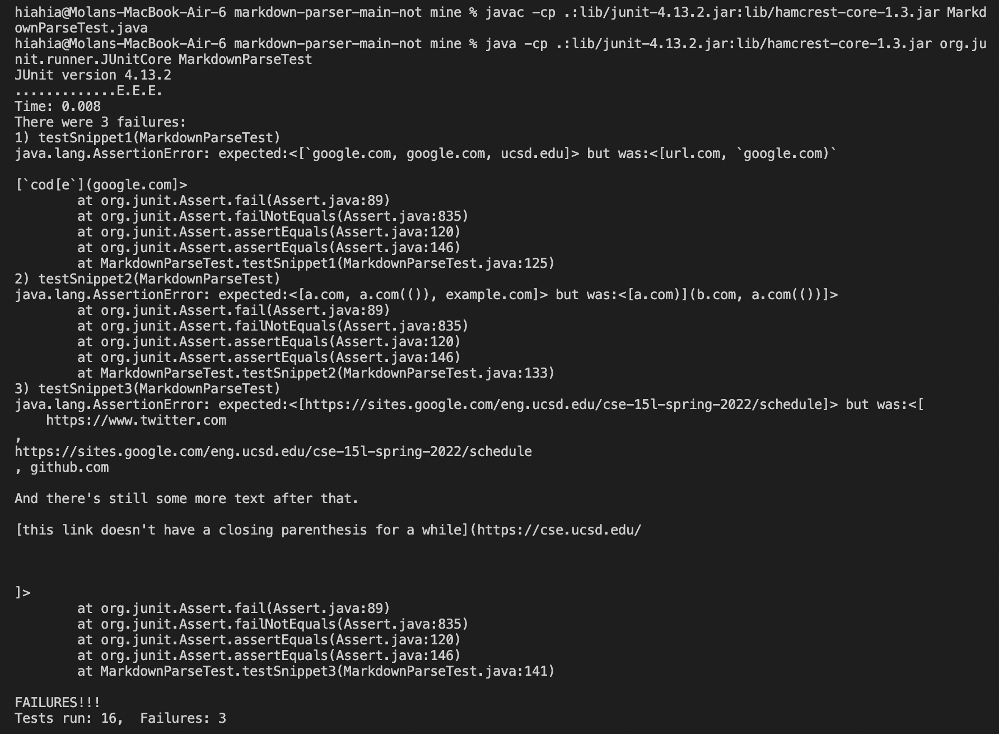

# lab-report-week-8
## The expected result:
* snippet1: [`google.com", "google.com", "ucsd.edu]
* snippet2: [a.com", "a.com(())", "example.com]
* snippet3: [https://sites.google.com/eng.ucsd.edu/cse-15l-spring-2022/schedule]
* The code in MarkdownParseTest.java for how I turned it into a test:

## my repositry 
* [clikc here to go my repositry](https://github.com/molan0426/markdown-parser)

    * snippet1: There won't be a small (<10 lines) code change that will make your program work for snippet one and all related cases that use inline code with backticks.
    The reason for that is backticks can have different situations with open/closed brackets/parentheses and also need to take matched/unmatched brackets/parentheses, which makes the code revising become much more complicated.
    * snippet2: There won't be a small (<10 lines) code change that will make your program work for snippet 1 and all related cases that use inline code with backticks.
    The reseason for that is I did not take nest parentheses, brackets, and escaped brackets into consideration in my markdownPharser. In this case, there are a lot of cases for me to range nest parentheses, brackets, and escaped brackets, which make the code revising become much more complicated. I can make the example.com back into the list by deleting one condition of (closeBracket +1 ==openParen), but this can cause other errors in other situations.
    * snippet3: There won't be a small (<10 lines) code change that will make your program work for snippet 1 and all related cases that use inline code with backticks. 
    The reseason for that is I did not take nest parentheses, brackets, newlines, and escaped brackets into consideration in my markdownPharser.

* [clikc here to go the repositry that I reviewed in week 7
](https://github.com/thanhnhanlam/markdown-parser.git)

    * snippet1: There won't be a small (<10 lines) code change that will make your program work for snippet 1 and all related cases that use inline code with backticks.
    The reason for that is I need to deal with open/closed brackets/parentheses and matched/unmatched brackets/parentheses, which make the code revising become much more complicated. Also, because of its code, it takes all things after the 5th line's open parenthesis as a large link.
    * snippet2: There won't be a small (<10 lines) code change that will make your program work for snippet 1 and all related cases that use inline code with backticks.
    The reseason for that is this file contains unmatched brackets/parentheses, nest parentheses, brackets, and escaped brackets into considering in my markdownPharser. In this case, revising the code can be harder than the first case.
    * snippet3: There won't be a small (<10 lines) code change that will make your program work for snippet 1 and all related cases that use inline code with backticks. 
    The reseason for that is I did not take nest parentheses, brackets, newlines, and escaped brackets into consideration in my markdownPharser. The code takes all things after the 14th line's open parenthesis as a large link because it did not detect the existence of closed parenthesis at the end of the 14th line, and dealing with unmatched brackets/parentheses can be related to previous cases, which are complicated to revise.

